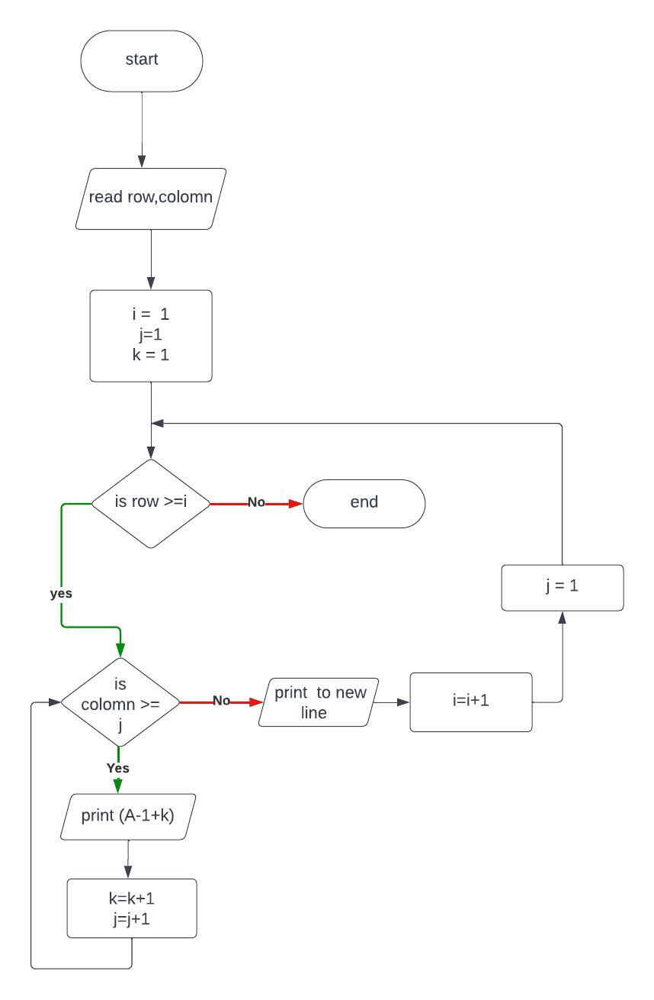

# 1,Problem Discription
Program to draw rectangle with continous letter
# 2,Program Analysis
## Input
row , colomn
## process
make a row with letter starting from a to letter  
repeat it for row times 
## Output
rectangle with letter
# 3, Algorithm
## 3.1 Pseudocode
step 1:Start  
step 2: read row , colomn  
step 3: compute i=1 , j=1,k=1  
step 4.1: if row>= i then  
&emsp;&emsp;&emsp;&emsp;step 4.2j=1 
&emsp;&emsp;&emsp;&emsp;if colomn>=j then  
&emsp;&emsp;&emsp;&emsp;&emsp;&emsp;print A-1+k  
&emsp;&emsp;&emsp;&emsp;&emsp;&emsp;k=k+1  
&emsp;&emsp;&emsp;&emsp;&emsp;&emsp;j=j+1  
&emsp;&emsp;&emsp;&emsp;&emsp;&emsp;goto step 4.1  
&emsp;&emsp;&emsp;&emsp;end if 
&emsp;&emsp; print (new line) 
&emsp;&emsp;i=i+1  
&emsp;&emsp;goto step 4.1  
End if 
step 5: stop
## Flowchart
  
# 4 problem Design 
## 4.1 Vaiable declaration
int colomn,row; 
int j=1; 
int i=1;  
int k(1);
## 4.2 Input Operation
cout<< "enter the row: ";  
cin >> row; 
cout << "enter the colomn: "; 
cin >> colomn;
## 4.3 Operation
###### loop for rows
for(int i=1; row>=i; i++){
###### loop for one row 
for(int j=1; colomn>=j; j++){  
###### change to integer to character
cout << char(64+k)<< " "; 
k++;  
     }
###### to new line
cout << endl;
## 4.4 Output Operation
cout << char(64+k)<< " "; 
cout << endl;

