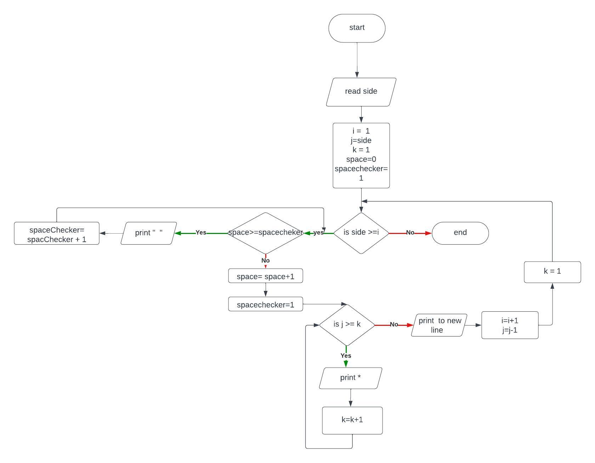

# 1,Problem Description
Program to to construct full inverted triangle(pyramid)
# 2,Problem analysis
## Input 
side
## process
Printing row using a star 
Repeat for each colomn 
## Output
triangle for inverted full pyramid 
# 3, Algorithm 
## 3.1 Pseudocode
step 1: start  
step 2: read side  
step 3: compute i=1 , j=side, k=1,space=0, spaceCheker=1  
step 4.1: if side >= i then  
&emsp;&emsp;&emsp;&emsp;&emsp;step 4.2 if space >= spaceChecker then  
&emsp;&emsp;&emsp;&emsp;&emsp;&emsp;&emsp;print "   "  
&emsp;&emsp;&emsp;&emsp;&emsp;&emsp;&emsp;spaceChecker = spaceChecker + 1  
&emsp;&emsp;&emsp;&emsp;&emsp;&emsp;&emsp; goto step 4.2  
&emsp;&emsp;&emsp;&emsp;&emsp;&emsp;&emsp; End if  
&emsp;&emsp;&emsp;&emsp;&emsp;space = space + 1  
&emsp;&emsp;&emsp;&emsp;&emsp; spaceChecker = 1  
&emsp;&emsp;&emsp;&emsp;step 4.3 if j>= k then  
&emsp;&emsp;&emsp;&emsp;&emsp;&emsp; print "*  "  
&emsp;&emsp;&emsp;&emsp;&emsp;&emsp; k=k+1  
&emsp;&emsp;&emsp;&emsp;&emsp;&emsp; goto step 4.4  
&emsp;&emsp;&emsp;&emsp;&emsp;endif  
&emsp;&emsp;&emsp;&emsp; k=1  
&emsp;&emsp;&emsp;&emsp; print(to new line)  
&emsp;&emsp;&emsp;&emsp; j=j-1  
&emsp;&emsp;&emsp;&emsp; i = i+1  
&emsp;&emsp;&emsp;&emsp; goto step 4.1  
end if  
step 5: end 
## FlowChart
 
# 4,Program Design
## 4.1 Variable declaration
int side,i(1),j(1),k(1),space(0), spacecheker=1;  
## 4.2 Input Operation
cout<< "This program produce inverted full pyramid.\nEnter the side: ";  
cin >> side;
## 4.3 Process
###### row loop
 while(side >= i){
###### loop for adding white space
while(space>=spacecheker){ 
cout<< "  "; 
spacecheker++; 
 } 
space++; 
spacecheker=1; 
###### loop for row construction with star
while(j>=k){; 
            cout<<"*   "; 
            k++; 
        }; 
###### decrease size of next row
j--;
##### for next row calling
i++;
