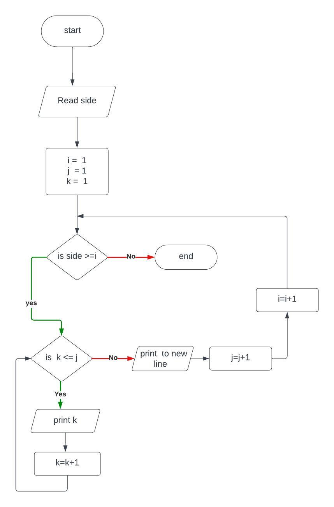

# 1,Problem description
Program to draw a half triangle with small number in consqutive manner
# 2, Problem Analysis
## Input
side
## Process
Construct row with equal number of side  
Add size of row  
Print Each rows 
# 3,Alogoritm
## 3.1 Pseudocode
step 1: start  
step 2: read side 
step 3: compute j=1 ,i=1, k=1  
step 4.1: if i<=side then  
&emsp;&emsp;&emsp;&emsp;step 4.2 if k<=j then  
&emsp;&emsp;&emsp;&emsp;&emsp;&emsp; print k  
&emsp;&emsp;&emsp;&emsp;&emsp;&emsp; goto step 4.2  
&emsp;&emsp;&emsp;&emsp;End if   
&emsp;&emsp;&emsp;j=j+1  
&emsp;&emsp;&emsp;print (to new line)  
&emsp;&emsp;&emsp;i=i+1  
&emsp;&emsp;&emsp;goto step 4.1  
&emsp;End if  
step 5: End if 
## Flow charts
  
# Program Design
## 4.1 Variable
int side,j(1);  
int i = 1; 
int k=1;
## 4.2, Input Operation
cout << "Enter side:";  
cin >> side;
## 4.3 Operation
###### loop for rows
for(int i = 1; i<=side; i++){
###### loop for single row 
for(int k=1; k<=j; k++){ 
cout << k << "  "; 
}
###### adding size of colomn 
j++;
###### new line
cout << endl;
## 4.4 Output Operation
cout << k << "  ";

