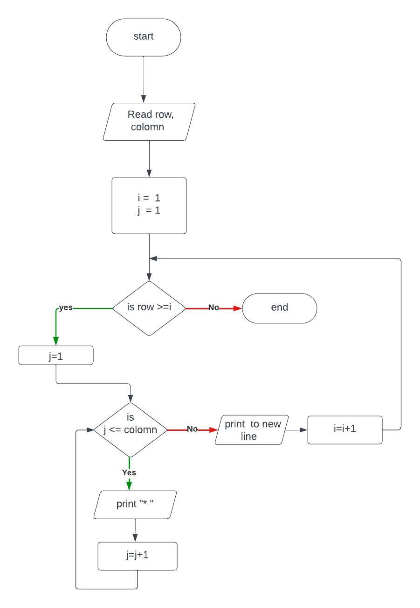

# 1,Problem Description
Program to  rectangle using star
# 2,Problem analysis
## Input 
row, colomn
## process
Printing row using a star 
Repeat for colomn with increaing number 
## Output
number rectangle with with certain row and colomn with star
# 3,Alogrithm
## pseudocode
step 1: Start  
step 2: Read row, colomn  
step 3: compute i=1, j=1  
step 4.1: if row >= i then  
&emsp;&emsp;&emsp;&emsp;&emsp;&emsp;step 4.2if colomn >= j then  
&emsp;&emsp;&emsp;&emsp;&emsp;&emsp;&emsp;&emsp; print "*  "  
&emsp;&emsp;&emsp;&emsp;&emsp;&emsp;&emsp;&emsp; j=j+1  
&emsp;&emsp;&emsp;&emsp;&emsp;&emsp;&emsp;&emsp; goto step 4.2 
&emsp;&emsp;&emsp;&emsp;&emsp;&emsp;&emsp;&emsp; end if  
&emsp;&emsp;&emsp;&emsp;&emsp;&emsp; j=1  
&emsp;&emsp;&emsp;&emsp;&emsp;&emsp; print (to)new line  
&emsp;&emsp;&emsp;&emsp;&emsp;&emsp; i=i+1  
&emsp;&emsp;&emsp;&emsp;&emsp;&emsp; goto step 4.2  
&emsp;&emsp;&emsp; endif 
step 5: end
## Flowchart
  
# 4, Program design
### 4.1 variable declaration
int row,colomn, i(1),j(1);
### 4.2 Input Operation
cout << "enter row: ";  
cin >> row;  
cout << "enter colomn: ";  
cin >> colomn;  
### 4.3 Process
##### looping the rows 
while(row>=i){
##### looping to draw one full row
while(colomn>=j){
##### printing a star  
cout<<"*  ";  
j++;  
    }  
j=1;  
cout<<endl;  
i++;  
}  
### 4.3 Output operation
cout<<"*  ";  
cout<<endl;
