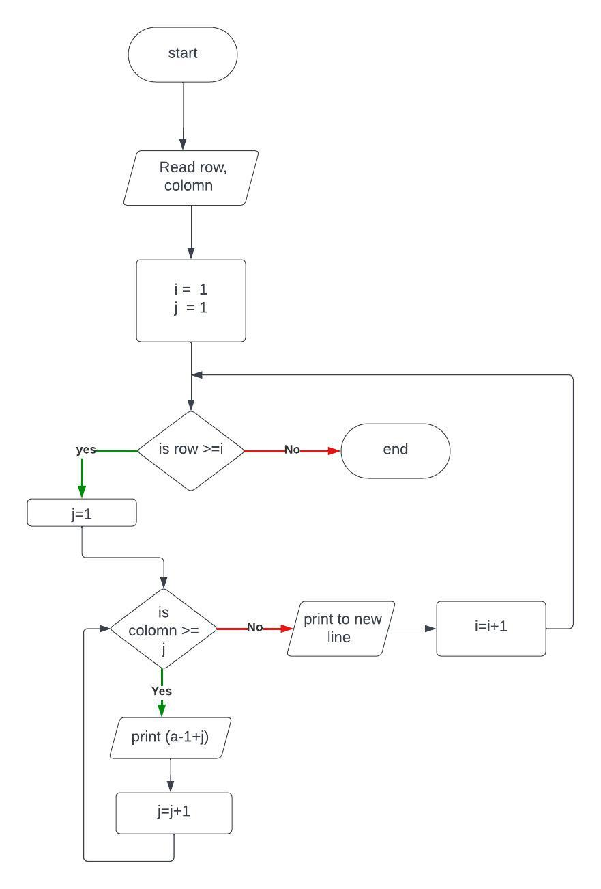

# 1,Problem Discription
Program to draw rectangle with letter
# 2,Program Analysis
## Input
row , colomn
## process
make a row with letter starting from a to letter  
repeat it for row times 
## Output
rectangle with letter
# 3, Algorithm
## 3.1 Flowchart
  
# 4,Program Design
## 4.1 Varaible declaration
char letter; 
int row,colomn; 
int i=1; 
int j=1;
## 4.2 Input declaration
cout<< "Enter the raw: "; 
cin>> row; 
cout<< "Enter the colomn: "; 
cin>> colomn;
## 4.3 Operation
###### loop for next row
for(int i=1; i<=row;i++){
###### loop for one row
for(int j=1;j<=colomn;j++){
###### changing number to char
cout << char(96+j)<< "  "; 
        }
###### to new line
cout << endl;
## 4.4 Output Operation
cout << char(96+j)<< "  ";

