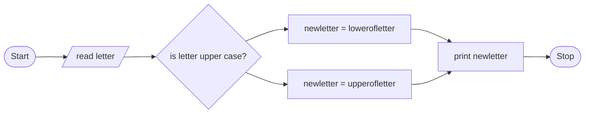

# 1,Problem Discription
Write a program that converts a letter to Uppercase or Lowercase if it is lowercase or uppercase repectively  
# 2,Problem Analysis
## Input 
a letter(Upper or lowercase) 
## Output 
new letter(lower or upper case equvalent)
## Process
1,check whether upper or lower  
2,change to upper if lower  
3,change to lower if upper  
# 3, Algoritm Design 
## 3.1 In Psuedocode
step 1 : Start  
step 2 : read letter  
step 3 : If letter is upper  
then: new_letter = lower(letter)  
Else : new_letter = upperletter)  
endif  
step 4 : Print newletter  
Step 5 : Stop  
## #.2 In flowchart
ALGORITHM(FLOWCHART)

# 4,Design the program(in C++)
##### 4.1 Importing library(ctype library)
include <ctype.h>
##### 4.2 Variable declaration and intialization
char letter, new letter  
##### 4.3 Reading the input data
cout << "Enter the letter" << endl;
cin >> letter;
##### 4.4 Main operation 
###### 4.4.1 checking the letter if it is capital using if (isupper(letter) == true){...}
###### 4.4.2 opration to change it to lowercase using newLetter = tolower(letter) 
###### 4.4.3 opration to change it to uppercase using  newLetter = toupper(letter)
##### 4.5 printing on screen
cout << "New letter is "<<"\""<<newLetter << "\""
