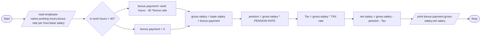

# 1,Problem Description
Write a program to read an employee name, working hours, bonus rate per hour and base salary and print the empolyee gross-salary, net salary and bonus payment.
# 2,Problem analysis
### Input
employee name  
working hours  
bonus rate per hour  
base salary
### Output
gross-salary 
net salary 
bonus payment
### Process
bonus payment =  working hour * bonus rate per hour
gross-salary = base salary + bonus payment
pension = gross-salary * PENSION RATE
Tax = gross-salary * TAX rate
net salary = gross-salary - (pension + Tax)
# 3 algorith
## 3.1 in psuedocode
step 1 : start   
step 2 : read employee name,working hours,bonus rate per hour,base salary   
step 3 : if work hours > 40, then bonus payment = (work hours - 40 ) * bonus rate else zero  
step 4 : compute bonus payment =  working hour * bonus rate per hour  
step 5 : gross-salary = base salary + bonus payment  
step 6 : pension = gross-salary * PENSION RATE  
step 7 : Tax = gross-salary * TAX rate  
step 8 : net salary = gross-salary - (pension + Tax)  
step 9 : print bonus payment, net salary  
step 10 : stop 

#4 Program design
##### 4.1 Variable declaration and intialization
string employee name float working hours,bonus rate per hour,base salary,overtime,gross_salary,net_salary
##### 4.2 constant declaration and intialization
#define PENSIONRATE 0.05 
#define TAX 0.15
##### 4.3 Reading the input data
cout << "Enter emplyee name ";
cin >> employeeName; 
cout << "enter weekly working hour ";  
cin >> workHour; 
cout << "enter weekly bonus rate per hour ";  
cin >> bonusRate; 
cout << "enter baseSalary "; 
##### 4.4 Main operation 
1,checking over time  
if (workHour > 40) {  
    overtime = (workHour-40)*bonusRate; 
    cout << "The bonus payment is " << overtime << endl; 
} 
else{ 
    overtime = 0; 
    cout << "The bonus payment is " << overtime << endl; 
} 
2,Operating main function  
cout << "The net salary is " << grossSalary-grossSalary*TAX -grossSalary*PENSIONRATE;
##### 4.5 printing on screen
cout << "The gross salary is "<< grossSalary<< endl;
cout << "The net salary is " << grossSalary-grossSalary*TAX -grossSalary*PENSIONRATE
;
