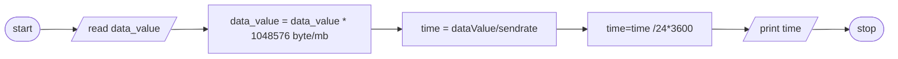

### 1,Problem Description
Write a program to calculate a time to send data to serial transmitter which can transmit 960 charcter per second.
### 2,Problem Analysis
#### Input 
size of data to be transmit(dataValue in mb)
#### Output 
time it takes to tramsimt(time)
#### Process
time = sendrate * dataValue  
### 3, Algoritm Design (In Psuedocode)  
step 1 : Start  
step 2 : read data_value 
step 3 : data_value = data_value * 1048576 byte/mb  
step 4 : time = dataValue/sendrate  
Step 5 : time = time / (24 * 3600) in  days  
step 6 : print time  
step 7 : stop  
## 3.2 In Flow chart
ALGORITHM(FLOWCHART)

### 4,Design the program
##### 4.1 Variable declaration and intialization
float dataValue, time; 
##### 4.2 Constant Declaration and intialization
#define sendRate 960 
##### 4.3 Reading the input data
cout << "enter the amount of data in mb  ";  
cin >> dataValue;
##### 4.4 main operation
dataValue = dataValue * 1048576; //to change mb to byte//  
time = dataValue / sendRate;
##### 4.5 print the output
cout << "The time requrired is approximetly "; 
-to change time in second to days(integer)   
cout << int((time/(24*3600))+0.5)<< " in days";</br
