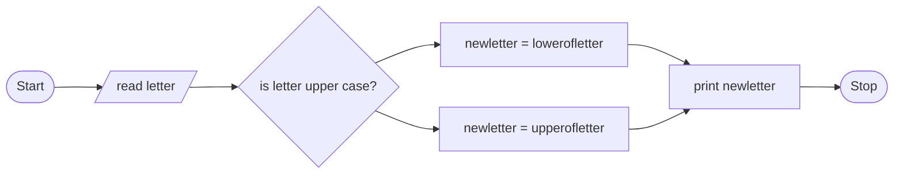

# Problem Discription
Write c++ program that converts a letter to its equivalent case
# Problem Analysis
## Input 
a letter
## Output 
new letter
## Process
check whether upper or lower then change it to its equivalent letter
# Algoritm Design in pseuocode
step 1 : Start

step 2 : read letter 

step 3 : If letter is upper 
then:new_letter =tolower(letter) 
Else : new_letter =toupperletter)

step 4 : Print newletter

Step 5 : Stop
## Algoritm Design in flowchart

# Design the program
## Variable declaration and intialization
char letter
## Reading the input data
cout << "Enter the letter" << endl;
cin >> letter;
## Perform operation
check if the letter is capital then change it to lowercase using newLetter = tolower(letter)
check if the letter is small then change it to uppercase using newLetter = toupper(letter)
## printing result
cout <<"upper or lower equivalent"<<"newLetter"<<;
