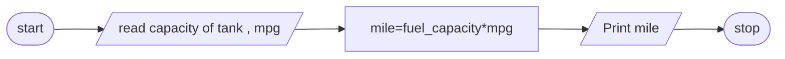

# Problem Discription
Write c++ program that calculate the number miles that an automobile can be driven with out refueling
# Problem Analysis
## Input 
float fuelcapcity,mpg(mile per gallon);
## Output
the number of miles that an automobile can be driven
## Process
mile=fuel_capacity*mpg;
# Algoritm Design in Psuedocode
step 1 : Start

step 2 : read  capacity of tank , mpg

step 3 : calculate mile=fuel_capacity*mpg

step 4 : Print mile

Step 5 : Stop 
## Algoritm Design in flowchart

# Design the program
## Variable declaration and intialization
float fuelcapcaity,mpg= 0;
## Reading the input data
cout << "Enter the capacity of the fuel tankin gallon";
cin >> fuelcapacity;
cout << " Enter mpg";
cin >> mpg;
## perform operation
mile=fuel_capacity*mpg;

## printing result
cout << "You can go " <<miles << " miles with full gallon";
