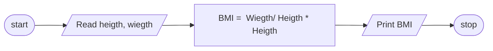

# 1,Problem Discription
Write a program that calculate Body mass index from reading heigth and weigth 
# 2,Problem Analysis
## Input 
Heigth 
Wiegth 
## Output
Body mass index (BMI)
## Process
BMI = Wiegth/ Heigth * Heigth  
# 3, Algoritm Design 
## 3,1 In Psuedocode
step 1 : Start  
step 2 : read wiegth and heigth  
step 3 : compute BMI =  Wiegth/ Heigth * Heigth  
step 4 : Print BMI  
Step 5 : Stop  
## 3.2 In Flow chart
ALGORITHM(FLOWCHART)

# 4,Design the program
##### 3.1 Variable declaration and intialization
float heigth,weigth = 0.0;  
##### 3.2 Reading the input data
cin >> Heigth;  
cin >> Wiegth;  
##### 3.3 Main operation 
BMI =  Wiegth/ Heigth * Heigth  
##### 3.4 printing on screen
cout <<  "BMI is" << Wiegth/ Heigth * Heigth;
