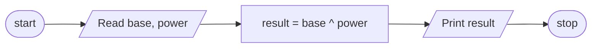

# 1,Problem Description
Write a program that find the result of the expression X power of y which accept two number(x,y) by user.
# 2, Problem Analysis
## Input 
base  
power  
## Output 
result
## Process
result = base ^ power  
# 3, Algoritm Design (In Psuedocode)  
step 1 : Start  
step 2 : read base, power  
step 3 : compute result = base ^ power 
step 4 : Print result  
Step 5 : Stop  

ALGORITHM(FLOWCHART)

# 4,Design the program(in C++)
##### 4.1 Importing library(cmath library)
include \<cmath\>
##### 4.2 Variable declaration and intialization
double base,power;  
##### 4.3 Reading the input data
cout << "enter the first number "; 
cin >> base; 
cout << "enter the secound number  "; 
cin >> power;
##### 4.4 Main operation 
result = pow(base, power);
##### 4.5 printing on screen
cout << "the result is equals to " << pow(base,power);
